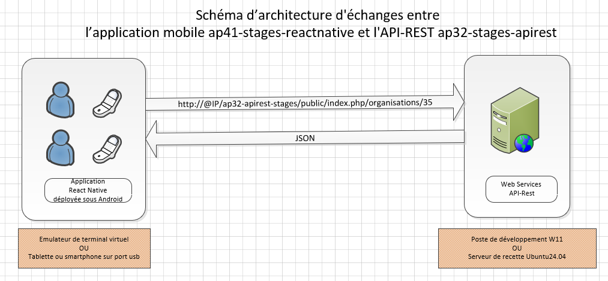
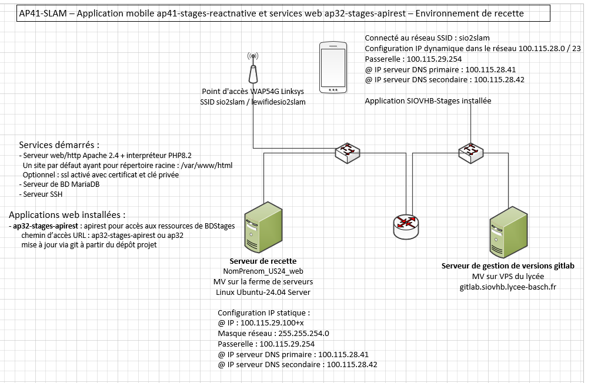

# Projet ap41-stages-reactnative – Application mobile

## Expression du besoin
Les étudiants de la section STS-SIO du lycée VHB ont l'obligation d'effectuer 2 stages sur des périodes différentes, en mai-juin de 1ère année, puis en janvier-février de 2ème année.

Les étudiants de la section STS-SIO du lycée VHB sont tous dotés d'un smartphone soit sous Android, soit sous IOS. L'application pourra être utilisée pour avoir accès à la liste des organisations ayant déjà accueilli un stagiaire, et renseigner rapidement les principales caractéristiques de chacun des stages à effectuer durant la formation.

## Application mobile et services web de type REST
Comme les smartphones sont répartis 50 / 50 entre Android et IOS, il a été décidé de réaliser une application mobile s'appuyant sur React Native, un seul code source avec un déploiement multi-plateformes. Elle sera développée en langage JavaScript avec accès distant aux données gérées par des services web de type REST.

Les services web de type REST sont hébergés sur le poste de développement lors de la réalisation, puis sur le serveur de recette lors de la recette.

Les services web de type REST ont été développés précédemment conformément à la documentation utilisateur, un document api-NomRessource.md par ressource. 

Les adaptations de l'API-REST réalisées dans le sprint 3 ont permis de s'adapter aux exigences de la version 1 de l'application Android.
 
### Exigences fonctionnelles opérationnelles
La première version 1.0 de l'application mobile ap41-stages-reactnative permet de :
-	s’authentifier comme étudiant à partir de son nom et mot de passe
-	visualiser la liste générale des organisations
-	visualiser et modifier le détail d'une organisation

### Exigences fonctionnelles demandées
Le projet est destiné à couvrir la plupart des exigences fonctionnelles décrites ci-dessous. Le projet sera découpé en plusieurs milestones présentés plus loin.

Les exigences fonctionnelles demandées impliquent d'analyser et de mettre en œuvre les évolutions sur plusieurs plans :
- Interface utilisateur de l'application mobile
- Choix des composants intégrés dans React Native, articulation entre composants, gestion des états des composants
- Invocation des opérations de l'API-REST 

#### EXG-01 **	
Améliorer l'interface utilisateur de la liste des organisations afin de faire figurer dans cette liste les informations essentielles de chaque organisation, à savoir nom, adresse postale, code postal, ville et numéro de téléphone. 

#### EXG-02 **
Compléter le formulaire de modification d'une organisation pour permettre la modification de l'intégralité des informations modifiables via l'API-REST. A voir pour que le numéro de téléphone soit en lien direct avec l'application de gestion des appels téléphoniques, le site web en lien direct avec un navigateur.

#### EXG-03 *
Afficher le login (email) de l'étudiant dans la barre d'entête de l’application mobile, une fois l'étudiant connecté.

#### EXG-04 *
Donner la possibilité à l'utilisateur de se déconnecter à partir de tout écran, excepté celui de connexion. C'est l'écran de connexion qui s'affichera une fois la déconnexion réalisée.

#### EXG-06 *
Dans le formulaire d'authentification, désactiver le bouton Valider lorsque login et mot de passe ne sont pas tous les 2 renseignés. Contrôler le bon domaine de valeurs des login et mot de passe : longueur et format.

#### EXG-10 **
Visualiser la liste des contacts d'une organisation donnée avec ajout possible d'un nouveau contact.

#### EXG-11 ***
Ajouter un stage pour l'étudiant connecté.

#### EXG-12 **
Visualiser la liste des stages déjà recensés, triée par date avec un affichage général et la possibilité de visualiser tous les détails pour un stage donné.
API-REST : pour l'instant, on récupère tous les stages. On pourra prévoir d'interroger l'API avec un critère de recherche sur l'option ou la ville sur la ressource stages - /stages?ville=:nomVille

#### EXG-Stages-13	****
Visualiser la liste des organisations d’un département donné sur une carte Google Map.

## Environnement de développement
### Environnement de développement application react Native
- Node.js (version >= 18) et npm
- Framework Expo pour aide aux tests
- Gestionnaire de terminaux virtuels via Android Studio
- Terminaux virtuels sous Android et/ou smartphone personnel
- Répertoire de dépôt en local et sur le serveur [GitLab](https://gitlab.siovhb.lycee-basch.fr/sio2-2526/ap41-stages-reactnative)

### Environnement de développement de l'API-Rest
- Environnement de Développement Visual Studio Code
- W11 avec xampp : serveur web Apache 2.4 + PHP8.2, serveur MariaDB 10.6, application de bureau MySql WorkBench / application web phpMyAdmin de xampp pour administrer la base de données.
- Extension Talend API-Tester sous le navigateur Chrome
- Répertoire de dépôt en local et sur le serveur GitLab [GitLab](https://gitlab.siovhb.lycee-basch.fr/sio2-2526/ap32-stages-apirest)

## Environnement de recette
L'application ap41-stages-reactnative doit pouvoir s'exécuter sur des tablettes et smartphones Android de version SDK minimum 24.

Les services web et le serveur de données MariaDB sont hébergés sous le serveur de recette mis en œuvre en AP32.

 
## Planification du projet ap41-stages-reactnative
Une première séance de 3 heures est dédiée à la compréhension de l’objectif de la réalisation professionnelle, à la création du projet Gitlab ap41-stages-reactnative par fork du projet modèle, à la création d'une branche dev ou integration, ainsi qu'au test de l'application React Native s'adressant à l'API-REST de l’environnement de développement et de recette de chaque membre de l’équipe.

Le projet est découpé en plusieurs milestones successifs. 

** Dans chacun des milestones 1 et 2, chaque membre de l’équipe aura la responsabilité d’une exigence fonctionnelle. **

### Milestone n° 1 - 8h
- EXG-Stages-01 à EXG-Stage06
- Productions attendues :
  - Version 1.1 de l'application mobile intégrant les exigences fonctionnelles ci-dessous, et des éventuels impacts sur l'API-REST.
  - Documentation technique de chaque exigence fonctionnelle analysant les impacts sur l'application mobile en termes d'interface utilisateur sur les layouts, de logique applicative sur les composants JSX et d'invocation de l'API-REST sur les composants api.

### Milestone n°2 - 12h
- Au moins trois exigences fonctionnelles parmi EXG-Stages-10 à EXG-Stages-13
- Production attendues :
    - Version 2.0 de l’application mobile et des services web intégrant les exigences fonctionnelles ci-contre, et des éventuels impacts sur l'API-REST.
    - Documentation technique de chaque exigence fonctionnelle analysant les impacts sur l’application mobile d’une part, l'API-REST d’autre part.
