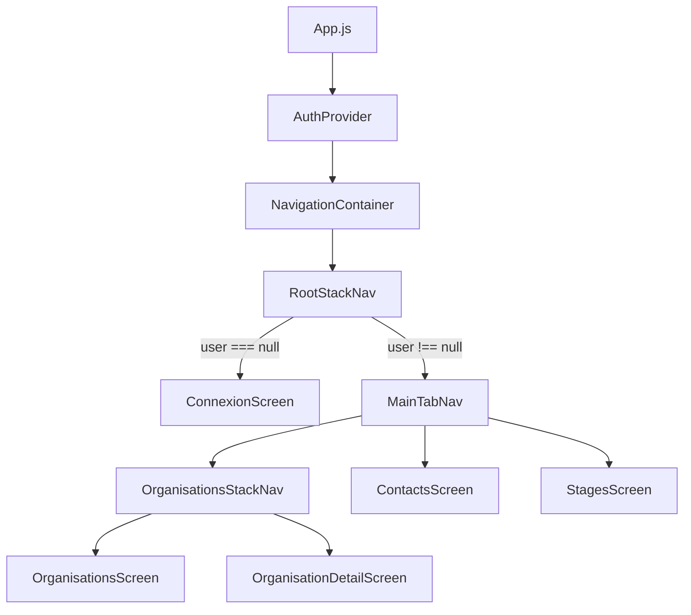

# Déploiement du dépôt
## Clonage du dépôt
En mode ssh, le clonage du dépôt sur votre poste local se fait par la commande suivante :
```bash
git clone git@gitlab.siovhb.lycee-basch.fr:annie-baraban/ap41-stages-reactnat.git
```
Une fois le dépôt cloné, votre répertoire courant disposera d'un nouveau sous répertoire nommé `ap41-stages-reactnat`.

## Installer les modules node et configurer votre application
Assurez-vous d'avoir installé au préalable nodejs de version >= à 18.

- Se positionner dans le répertoire local contenant votre dépôt
- Lancer la commande suivante pour installer les modules spécifiés dans package.json sous `node_modules` :
```bash
npm install  
```

Ce projet utilise des variables d'environnement pour gérer les endpoints d'API. Nous utilisons le système natif d'Expo (`EXPO_PUBLIC_`).

Les variables d'environnement réelles ne sont pas versionnées pour des raisons de sécurité et de flexibilité locale. Pour commencer, créez votre propre fichier `.env` à la racine du projet en vous basant sur le modèle fourni :

```bash
# Copier le modèle vers le fichier local
cp .env.dist .env
```
Dans ce fichier `.env`, adapter la valeur de la variable `EXPO_PUBLIC_API_BASE_URL` de l'API-Rest en fonction de l'environnement d'exécution de l'API-Rest.

>>>[!IMPORTANT]
Note sur l'adresse IP : Si vous testez sur un appareil physique (Android/iOS) via Expo Go, n'utilisez pas localhost. Utilisez l'adresse IP locale de votre machine (ex: 192.168.x.x).
>>>

## Lancer l'application sur terminal Android
### Démarrer le serveur Expo
Dans une fenêtre terminal, depuis le dossier du projet :
```bash
npx expo start
```
Vous verrez apparaître dans le terminal un QR code ainsi qu'un menu d'options.
### Tester sur terminal Android
1. Démarrez un terminal virtuel Android sur votre poste ou branchez un smartphone par câble usb sur votre poste de travail.
2. Appuyez sur a dans la fenêtre terminal pour y charger votre application. Vous devriez voir apparaître un écran de connexion.
3. Démarrez l'API-Rest ap32-stages-apirest avec l'authentification JWT
4. Saisissez l'adresse mail et le mot de passe d'un étudiant connu de votre API-Rest. Vous devriez voir la liste des organisations, nom et ville pour chacune d'elles. Les écrans liés aux contacts et stages sont en cours de construction.

### Pour tester sous un terminal virtualisé avec virtualbox:
Testé sous [android-x86](https://www.android-x86.org/).


1. Configurer le réseau de la machine virtuelle en mode pont.
2. Activer le débug usb dans son terminal android.
3. Noter l'adresse IP de la machine virtuelle: Systeme -> A propos -> Adresse IP
4. Dans la machine hôte démarrer le serveur `adb` en mode `tcpip`
    ```
    adb tcpip 5555
    ```
5. Dans la machine hôte, se connecter à la VM:
    ```
    adb connect IP:5555
    ```
6. Vérifier que la machine est listée en retour de la commande `adb devices`.
7. Lancer 
8. Démarrer le serveur Expo
    ```bash
    npx expo start
    ```
9. Taper `Shift + a` pour sélectionner une machine
10. Sélectionner votre machine virtuelle et appuyer sur entrer.

# Documentation technique sur l'application
## 1. Vue d'ensemble de l'Architecture

L'application repose sur une architecture modulaire utilisant **React Navigation** pour le routage et l'**API Context** pour la gestion globale de l'état.

### Schéma de Navigation et Flux
L'application utilise une architecture en couches où le contexte d'authentification pilote l'affichage des navigateurs.

- **Niveau racine (`App.js`)** : Point d'entrée qui enveloppe l'application avec le `AuthProvider` pour rendre les données accessibles partout.
- **Logique d'affichage (`RootStackNav.js`)** :
    - Si l'utilisateur n'est pas connecté (`user === null`) : Affiche `ConnexionScreen`.
    - Si l'utilisateur est connecté : Affiche `MainTabNav`.

## 2. Rôle du Contexte `AuthProvider`

Le fichier `AuthProvider.js` centralise toute la logique d'identité de l'application.

### Fonctionnalités Clés :
* **État global** : Maintient l'objet `user` (contenant l'email et le token JWT) et l'état `isLoading`.
* **Méthode `login`** : Appelle le service API `postConnexion`, récupère le jeton et met à jour l'état `user`.
* **Méthode `logout`** : Réinitialise l'état `user` à `null`, provoquant une redirection automatique vers l'écran de connexion via le `RootStackNav`.
* **Hook `useAuth`** : Permet à n'importe quel composant enfant (comme `RootStackNav`) d'accéder aux données sans passer par les "props".

## 3. Structure de Navigation Détaillée

L'application utilise une navigation imbriquée (Nested Navigation) pour séparer les responsabilités.

### MainTabNav (Navigation par Onglets)
Organise l'interface principale après connexion avec trois onglets :
1.  **Organisations** : Pointe vers `OrganisationsStackNav`.
2.  **Contacts** : Affiche `ContactsScreen`. Finalement, après étude des évolutions, il apparaît que cet onglet ne soit pas utile. En effet, les contacts sont consultés et modifiés au sein d'une organisation, donc via l'onglet **Organisations** une fois une organisation choisie.  
3.  **Stages** : Affiche `StagesScreen`.

### OrganisationsStackNav (Navigation de Pile)
Gère la navigation interne au sein de l'onglet Organisations :
* `Organisations` : Liste des organisations.
* `OrganisationDetail` : Détails d'une organisation spécifique.

## 4. Couche Service et API

Les appels API sont isolés dans des fonctions asynchrones pour faciliter la maintenance.

### Authentification (`login.js`)
* Effectue une requête `POST` vers `/login`.
* Gère les erreurs 401 en cas d'identifiants erronés.

### Gestion des Organisations (`organisations.js`)
* **Récupération** : `getOrganisations` utilise le token JWT dans le header `Authorization` (Bearer).
* **Mise à jour** : `putOrganisation` permet de modifier une entité via une requête `PUT`.

## 5. Composants et Transmission de Données

### ItemOrganisation.js
Ce composant illustre le passage de paramètres entre écrans. Lorsqu'un utilisateur appuie sur une carte d'organisation, l'objet complet `itemOrga` est transmis à l'écran `OrganisationDetail` via `navigation.navigate`, évitant ainsi un appel API supplémentaire.

## 6. Variables d'Environnement

Actuellement, l'application s'appuie sur une seule variable d'environnement pour la configuration réseau. Ces variables d'environnement pourront être complétées suivant les besoins.

- **`EXPO_PUBLIC_API_BASE_URL`** : Utilisée comme URL de base pour tous les services API (`login` et `organisations`). Elle permet de basculer facilement entre un environnement de développement local et un serveur de production sans modifier le code source.